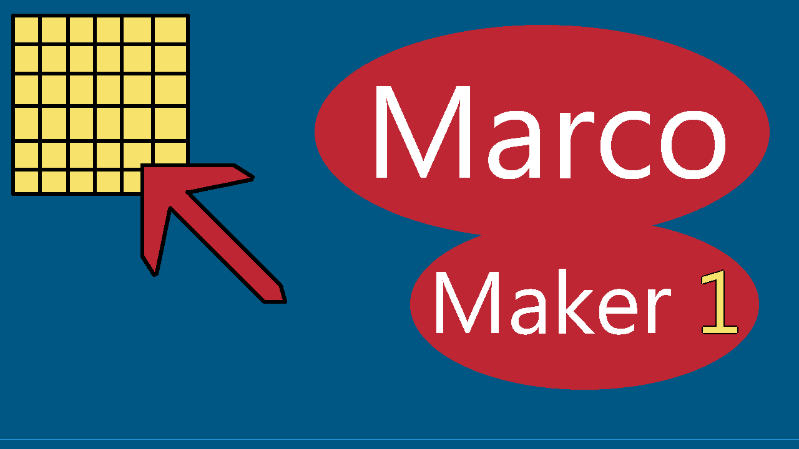
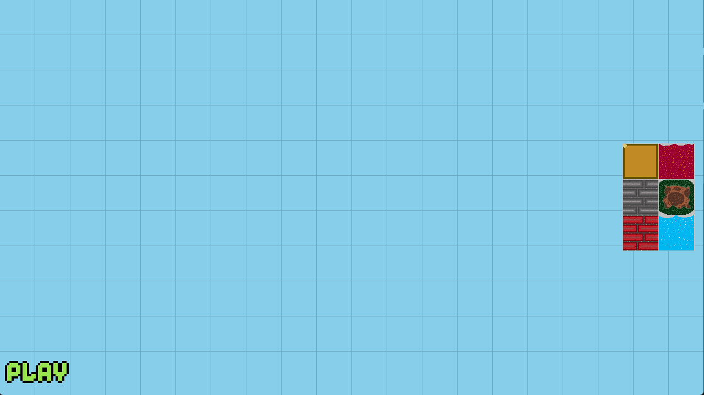
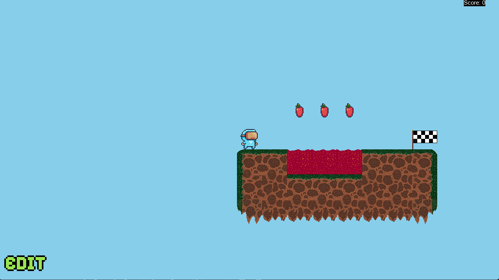

# Marco Maker



Juego inspirado en mario maker hecho con pygame-ce

## Instalación de requisitos

```bash
pip install -r requirements.txt
```

## Iniciar el juego

```bash
python game_maker
```

## Controles

### Creación de niveles



* Click izquierdo para colocar el asset seleccionado.
* Click derecho sobre un asset colocado para borrarlo.
* Click central para mover mundo.
* Flecha izquierda/derecha para cambiar entre los menús de assets.
* Girar el scroll del mouse para moverte por el mismo menú.
* Click en `Play` para empeza a jugar.

### Juego



* Flechas izquierda/derecha para mover el personaje.
* Barra espaciadora para salta (puede realizar doble salto).
* Click en `Edit` para regresar al modo edición.
